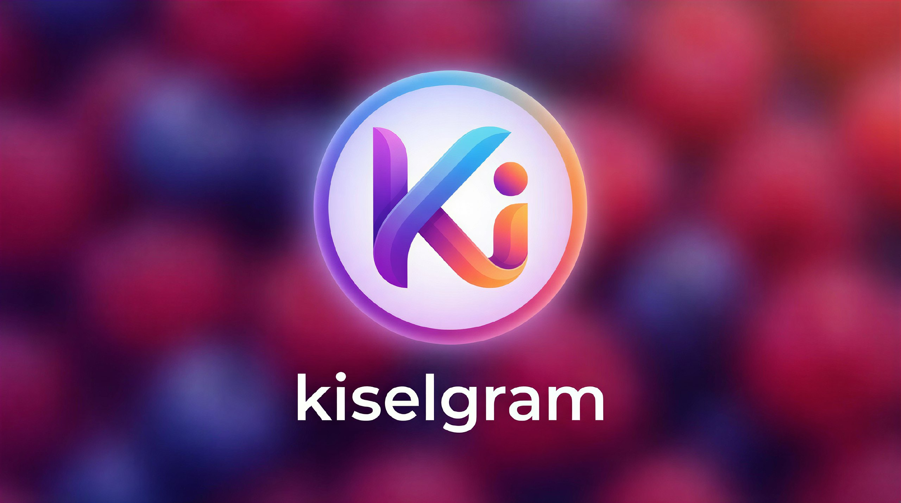

# Kiselgram



A complete messaging platform with groups, channels, file sharing, and real-time video chat. Built with Flask and SocketIO.

# ✨ Features

### 💬 Messaging
- **Personal Chats**: Direct messaging between users
- **Group Chats**: Create and manage group conversations
- **Channels**: Broadcast-style communication channels
- **Real-time Updates**: Instant message delivery

### 🎥 Video Chat
- **WebRTC Video Calls**: Peer-to-peer video communication
- **Audio-Only Mode**: Switch to audio-only for bandwidth saving
- **Room-Based**: Create and join video chat rooms
- **Multiple Participants**: Support for group video calls
- **Camera Switching**: Toggle between different cameras

### 📁 File Sharing
- **Multi-format Support**: Images, documents, audio, video
- **Auto-categorization**: Files automatically sorted by type
- **Thumbnail Generation**: Preview images before downloading
- **Size Limits**: Configurable upload limits

### 👥 Groups & Channels
- **Public/Private**: Choose visibility for groups and channels
- **Invite Links**: Shareable links for easy joining
- **Member Management**: View and manage participants
- **Owner Controls**: Special privileges for creators

### 🤖 Bot Integration
- **Telegram Bot Support**: Connect Telegram bots
- **Auto-responses**: Simulated bot interactions
- **Extensible**: Easy to add new bot functionality

# 🛠️ Tech Stack

- **Backend**: Python 3.7+, Flask
- **Database**: SQLAlchemy with SQLite
- **Real-time**: Flask-SocketIO
- **Video**: WebRTC via SocketIO
- **Frontend**: HTML, CSS, JavaScript
- **File Processing**: Pillow for images
- **Optional**: OpenCV for video processing

# 📁 Project Structure
````
kiselgram/
├── app/ # Main application
│ ├── models.py # Database models
│ ├── routes/ # Route blueprints
│ │ ├── channels.py # Channel routes
│ │ ├── chats.py # Chat routes
│ │ ├── files.py # File upload routes
│ │ ├── groups.py # Group routes
│ │ └── video_int.py # Video integration
│ └── utils/
│ ├── helpers.py # Utility functions
│ └── init.py
├── video_server/ # Standalone video server
│ ├── app.py # Video server with SocketIO
│ ├── templates/video/ # Video room templates
│ └── static/ # Video server assets
├── templates/ # Main app templates
├── static/ # Main app assets
├── uploads/ # User uploaded files
│ ├── images/
│ ├── documents/
│ └── media/
├── manage.py # Main management script
├── requirements.txt # Dependencies
├── .env # Configuration
└── README.md # This file
````


# 🚀 Installation

### Prerequisites
- Python 3.7 or higher
- pip package manager
- Virtual environment (recommended)

### Step-by-Step Setup

1. **Clone the repository**
   ```bash
   git clone https://github.com/kiselgram/kiselgram.git
   cd kiselgram
   ```

2. **Create and activate virtual environment**
   ```bash
   # On macOS/Linux
   python -m venv venv
   source venv/bin/activate
   
   # On Windows
   python -m venv venv
   venv\Scripts\activate
   ```

3. **Install dependencies**
   ```bash
   pip install -r requirements.txt
   ```

4. **Set up environment**

   **Option A: Auto-setup**
   ```bash
   # Auto-setup directories and config
   python manage.py setup
   ```

   **Option B: Manual setup**
   
   Create `.env` file:
   ```dotenv
   # Telegram Bot Configuration
   TELEGRAM_BOT_TOKEN=YOUR_BOT_TOKEN_HERE
   
   # Flask Configuration
   SECRET_KEY=your-secret-key-change-in-production
   DATABASE_URL=sqlite:///kiselgram.db
   
   # Server Configuration
   HOST=0.0.0.0
   PORT=5000
   DEBUG=True
   
   # Video Server Configuration
   VIDEO_PORT=5001
   VIDEO_HOST=0.0.0.0
   VIDEO_AUTO_START=True
   ```
## 🎯 Usage
## Starting the Application

### Quick Start
Start main app + video server:
```bash
python manage.py start
```

### Advanced Options

**Start with custom ports:**
```bash
python manage.py start --port 3000 --video-port 3001
```

**Start without video server:**
```bash
python manage.py start --no-video
```

**Start only video server:**
```bash
python manage.py video start --port 5001
```

## Management Commands

| Command | Description |
|---------|-------------|
| `python manage.py start` | Start main app + video server |
| `python manage.py stop` | Stop all services |
| `python manage.py restart` | Restart all services |
| `python manage.py status` | Check service status |
| `python manage.py video start` | Start only video server |
| `python manage.py video stop` | Stop only video server |
| `python manage.py setup` | Setup environment |
| `python manage.py clean` | Clean temporary files |
| `python manage.py reset-db` | Reset database (⚠️ deletes data) |
| `python manage.py test` | Run basic tests |

## Access Points

- **Main Application:** http://localhost:5000
- **Video Server:** http://localhost:5001
- **Video Chat Rooms:** http://localhost:5000/video/

# 📱 Features in Detail
Creating a Channel
``` http request
# Channel routes handle:
POST /create_channel      # Create new channel
GET /channel/<id>         # View channel
GET /join_channel/<link>  # Join via invite link
GET /channel_info/<id>    # View channel info
GET /leave_channel/<id>   # Leave channel
```
Creating a Group
```http request
# Group routes handle:
POST /create_group        # Create new group
GET /group/<id>           # View group chat
GET /join_group/<link>    # Join via invite link
GET /group_info/<id>      # View group info
GET /leave_group/<id>     # Leave group
```
## Video Chat Features
Create Room: Click "Start Video Chat" to create a room

Join Room: Use invite link or room ID to join

Toggle Audio-Only: Switch to conserve bandwidth

Switch Camera: Change between available cameras

Screen Sharing: Share your screen with participants

File Upload Support

| File Type | Allowed Extensions |
|-----------|-------------------|
| Images | jpg, jpeg, png, gif, bmp, webp |
| Documents | pdf, doc, docx, txt, rtf |
| Archives | zip, rar, 7z |
| Media | mp3, mp4, m4a, wav, ogg, avi, mov, mkv |

## 🔧 API Endpoints

### Video Server API
| Endpoint | Method | Description |
|----------|--------|-------------|
| `/api/rooms` | GET | List all active video rooms |
| `/api/rooms/create` | POST | Create new video room |
| `/api/rooms/<room_id>` | GET | Get room information |
| `/health` | GET | Video server health check |

### Status API
| Endpoint | Method | Description |
|----------|--------|-------------|
| `/api/user_status/<id>` | GET | Get user online status |
| `/api/mark_read/<id>` | POST | Mark messages as read |

# 🤝 Contributing

1. Fork the repository
2. Create your feature branch (`git checkout -b feature/AmazingFeature`)
3. Commit your changes (`git commit -m 'Add AmazingFeature'`)
4. Push to the branch (`git push origin feature/AmazingFeature`)
5. Open a Pull Request

# 📝 License

This project is licensed under the MIT License - see the LICENSE file for details.

# 👥 Authors

- **DANILKISEL** - Initial work

# 🙏 Acknowledgments

- Flask and Flask-SocketIO communities
- WebRTC for video capabilities
- All contributors and users

# 📞 Support

- GitHub Issues: [kiselgram/kiselgram/issues](https://github.com/kiselgram/kiselgram/issues)
- Project Link: [kiselgram/kiselgram](https://github.com/kiselgram/kiselgram)